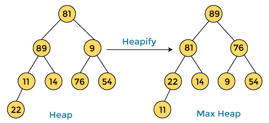

# Heap Sort

## Algorithm

1. Build a max heap from the input data.
2. At this point, the largest item is stored at the root of the heap. Replace it with the last item of the heap followed by reducing the size of heap by 1. Finally, heapify the root of the tree.
3. Repeat step 2 while size of heap is greater than 1.
4. The array is sorted in ascending order.

## Complexity

- Time: `O(nlogn)`
- Space: `O(1)`

## References

- [Heap Sort – Data Structures and Algorithms Tutorials](https://www.geeksforgeeks.org/heap-sort/)
