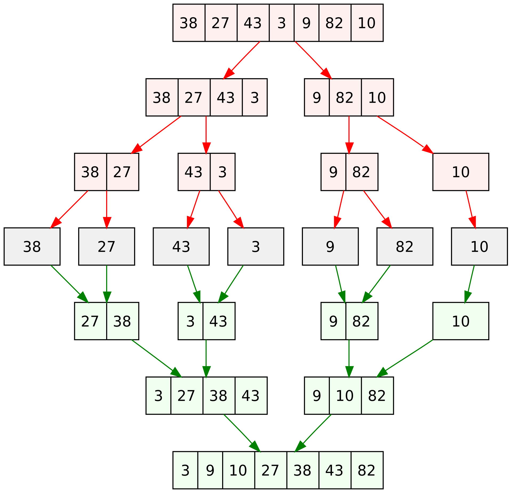

# Merge Sort

## Algorithm

1. Loop through the array and split it into two halves.
2. Recursively split the array into halves until you reach a subarray with one element.
3. Merge each subarray repeatedly to produce sorted subarrays and finally a sorted array.

## Complexity

- Time: `O(n log n)`
- Space: `O(n)`

## References

- [Merge Sort – Data Structure and Algorithms Tutorials](https://www.geeksforgeeks.org/merge-sort/)
